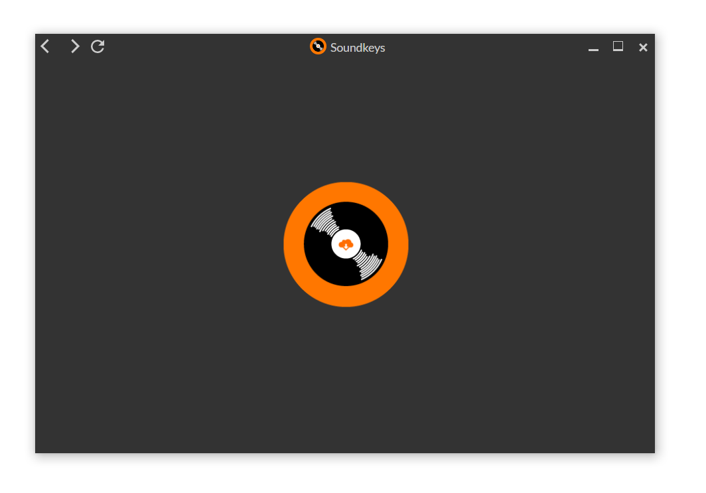
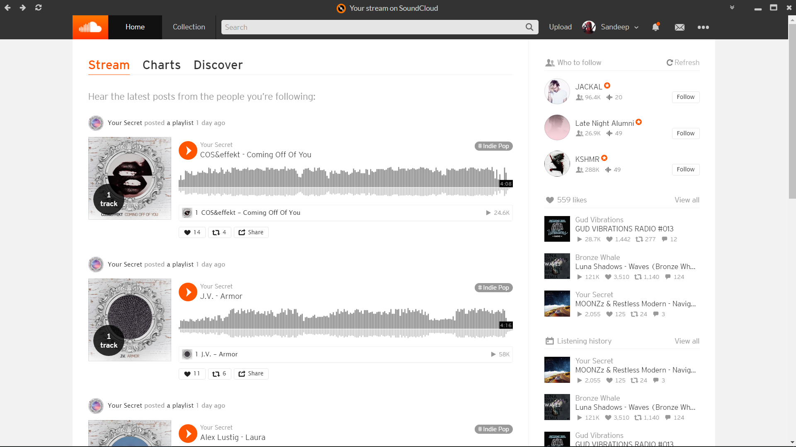
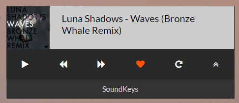

#  SoundKeys

Soundkeys serves straight from Soundcloud. Benefit from the website's features and caching! 😼

The SoundCloud website wrapped in Electron with shortcuts for a native experience.

Includes a mini-player with minimal controls as well.

Default shortcuts included are:

Global shortcuts :

| Keys                           | Actions          |
|:------------------------------:|:----------------:|
| `MediaNextTrack`               | Next Track       |
| `MediaPreviousTrack`           | Previous Track   |
| `MediaPlayPause`               | Play/Pause Track |
| `Ctrl+4`                       | Repeat Toggle    | 
| `Ctrl+3`                       | Like Toggle      |

## Notifications 

Get notified about your actions when the window is not visible. 💯  

### Install

Download from [here](https://github.com/MSandeep96/SoundKeys/releases). 💎 

### Build  

Building is a piece of cake as the app uses Electron. 🍰  
Follow these instructions to setup the app.  

	git clone https://github.com/MSandeep96/SoundKeys.git
	cd SoundKeys
	npm install
	npm start

You might want to consider installing Electron globally as it's huge. (~140 MB)  
Feel free to create an ISSUE or shoot me an email for any help. ✌️  
The app hasn't been tested on Linux or OSX. Please provide feedback if you did.

### RoadMap

Check the Projects tab for the roadmap. 😸

##### Login issues: (Only Facebook)😿

As Electron opens each window in a seperate process, login callbacks aren't triggered properly.  
If the application stalls for you, reload the page and try to login again. (Sometimes twice)  
Reload is mapped to F5.